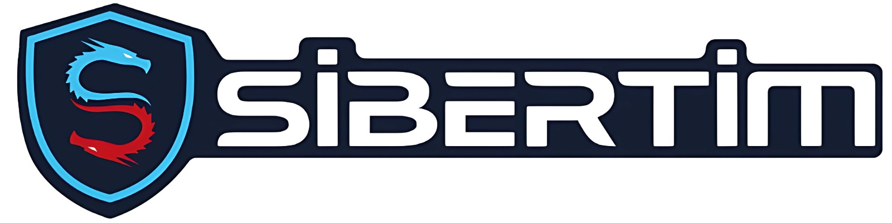

  
  
  # 🔐 Sibertim.com İçerikleri
  
  **Siber güvenlik alanında bilgi edinmek ve pratik yapmak için oluşturulmuş içerikler**
  
  
  
  
  

## Fortinet Ürünleri
Bu klasör, ağ ve web güvenliği alanında sıkça kullanılan,

**Fortinet** ürünlerine yönelik detaylı uygulama ve konfigürasyon rehberlerini içerir. FortiGate, FortiWeb, FortiAP, FortiMail ve FortiNAC gibi popüler Fortinet çözümlerinin kurulumu, yönetimi ve optimizasyonuna dair adım adım yönergeler sunar.

**İçerik Listesi:**
- FortiAP
- FortiGate
- FortiMail
- FortiNAC
- FortiWeb

---

## logo

- logo.jpg

---

Tüm içerikler eğitim amaçlıdır. İzinsiz çoğaltılamaz veya ticari amaçla kullanılamaz.

---

Daha fazla bilgi için [sibertim.com](https://sibertim.com) adresini ziyaret edebilirsiniz.
